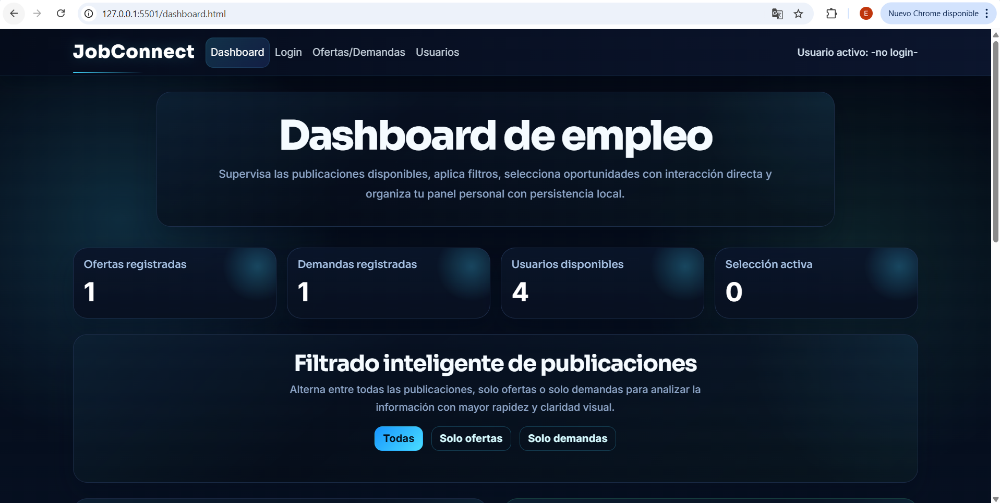
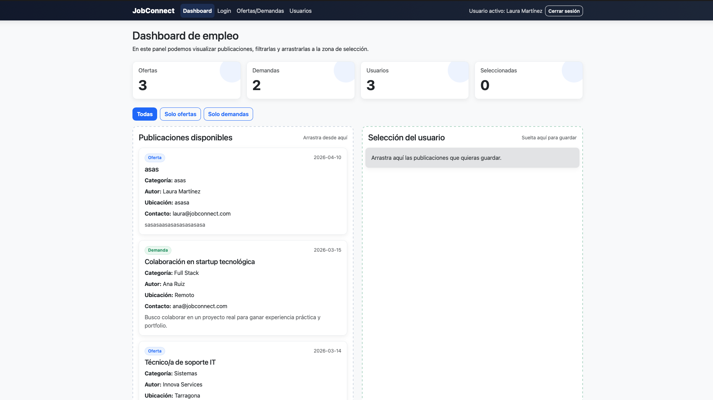
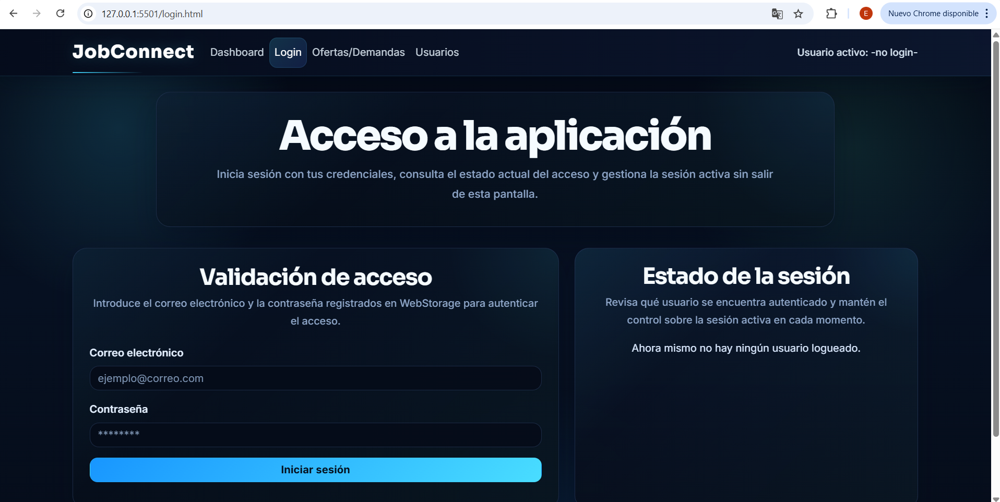
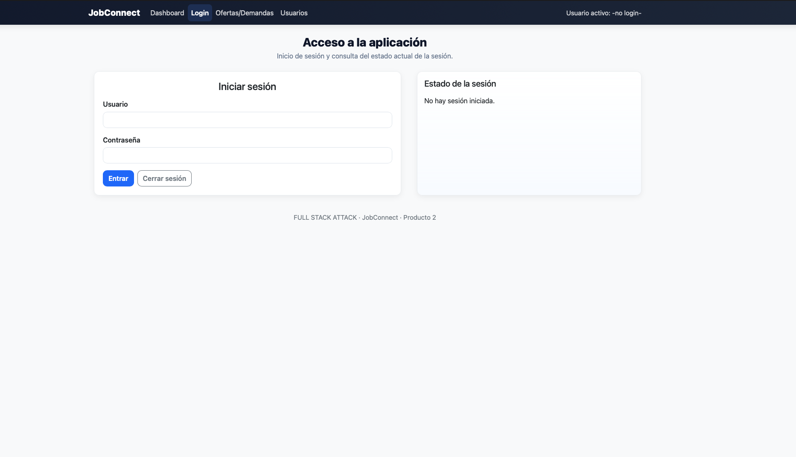
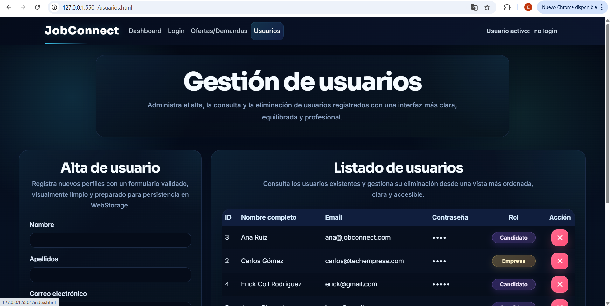
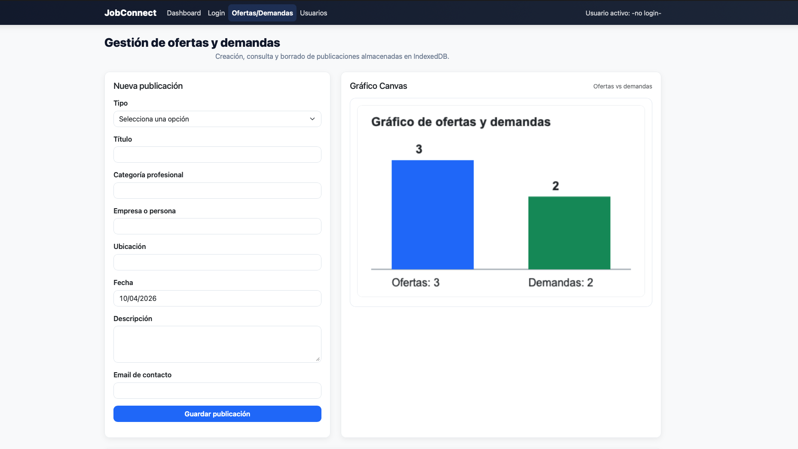
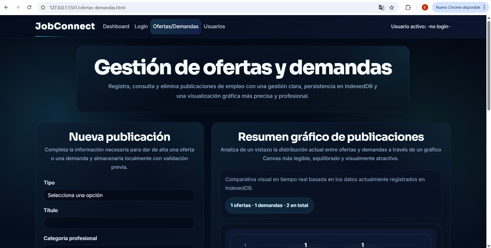
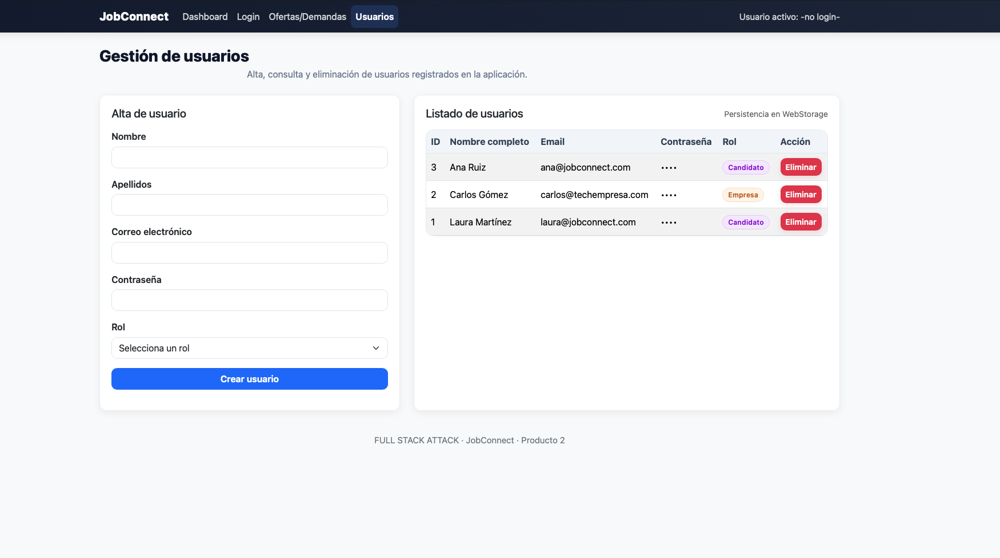

# Definición de interfaces - Producto 2 (JobConnect)

## 1. Introducción
Este documento describe las interfaces principales del **Producto 2** del proyecto **JobConnect**.

En esta fase, la aplicación ya no se limita a mostrar información en memoria como en el Producto 1, sino que incorpora:
- persistencia en navegador
- interacción con `localStorage`
- interacción con `IndexedDB`
- representación visual con `Canvas`
- selección de publicaciones mediante `Drag & Drop`

El objetivo de este documento es definir de forma clara cómo está organizada cada pantalla, qué elementos contiene y qué función cumple dentro del sistema.

---

## 2. Criterios generales de interfaz
Todas las pantallas del proyecto comparten una serie de criterios comunes:

- diseño basado en **Bootstrap 5**
- estructura responsive
- barra de navegación superior homogénea
- identificación visible del usuario activo
- uso de estilos comunes mediante `assets/css/styles.css`
- mensajes de feedback visual para acciones correctas e incorrectas
- separación clara entre formularios, listados y paneles interactivos

Además, todas las páginas mantienen una misma identidad visual para que el usuario perciba el proyecto como una aplicación unificada.

---

## 3. Navegación común
Todas las interfaces incluyen una barra de navegación superior con acceso a las secciones principales:

- **Dashboard**
- **Login**
- **Ofertas/Demandas**
- **Usuarios**

También se muestra un área informativa con:
- el texto `Usuario activo: ...`
- un botón para **cerrar sesión**, visible cuando hay sesión iniciada

Esto permite que el usuario conozca en todo momento su estado dentro del sistema y pueda moverse con facilidad entre pantallas.

---

## 4. Interfaz de Dashboard (`index.html`)

## 4.1 Objetivo
La pantalla de dashboard actúa como panel principal del sistema. Su función es:
- mostrar métricas generales
- visualizar publicaciones disponibles
- permitir seleccionar publicaciones
- guardar esa selección de forma persistente

---

## 4.2 Estructura visual
La interfaz del dashboard se compone de los siguientes bloques:

### a) Encabezado principal
Incluye:
- título `Dashboard de empleo`
- texto descriptivo introductorio

Su objetivo es situar al usuario y explicar la función general del panel.

### b) Tarjetas resumen
Se muestran cuatro tarjetas con métricas:
- total de ofertas
- total de demandas
- total de usuarios
- total de publicaciones seleccionadas

Estas tarjetas aportan una visión rápida del estado actual del sistema.

### c) Botones de filtro
Se incluyen tres botones:
- todas
- solo ofertas
- solo demandas

Permiten filtrar visualmente las publicaciones mostradas en el panel.

### d) Zona de publicaciones disponibles
Contenedor donde se generan dinámicamente las publicaciones que aún no han sido seleccionadas.

Cada publicación se muestra como una tarjeta visual con datos relevantes.

### e) Zona de selección del usuario
Contenedor de destino donde el usuario puede soltar publicaciones arrastradas desde la zona anterior.

Esta área representa la selección persistente del usuario.

### f) Área de mensajes
Existe un espacio para mostrar mensajes informativos, de error o de estado del dashboard.

---

## 4.3 Elementos funcionales principales
- `#total-ofertas`
- `#total-demandas`
- `#total-usuarios`
- `#total-seleccionadas`
- botones con atributo `data-filtro`
- `#mensaje-dashboard`
- `#contenedor-publicaciones`
- `#contenedor-seleccionadas`

---

## 4.4 Comportamiento esperado
La interfaz debe permitir:
- visualizar publicaciones guardadas en `IndexedDB`
- filtrar por tipo
- arrastrar publicaciones disponibles
- soltarlas en la zona de selección
- mantener la selección guardada
- actualizar los contadores automáticamente

---

## 5. Interfaz de Login (`login.html`)

## 5.1 Objetivo
La pantalla de login permite al usuario iniciar sesión con credenciales almacenadas en `localStorage`.

También informa del usuario activo actual.

---

## 5.2 Estructura visual
La interfaz se divide en dos columnas principales:

### a) Panel de formulario
Incluye:
- título `Iniciar sesión`
- texto explicativo
- formulario de acceso
- área de mensajes

### b) Panel de estado de sesión
Muestra información sobre el usuario activo actual o el estado sin sesión.

---

## 5.3 Campos y elementos funcionales
El formulario de login contiene:

- campo `#email-login`
- campo `#password-login`
- botón de envío del formulario
- contenedor `#mensaje-login`

Además, en la parte lateral aparece:
- `#usuario-activo-pagina`

Y en la navbar:
- `#usuarioActivo`
- `#btn-cerrar-sesion`

---

## 5.4 Comportamiento esperado
La interfaz debe permitir:
- introducir email y contraseña
- validar que ambos campos estén rellenados
- comprobar credenciales contra los usuarios almacenados
- guardar el usuario activo en `localStorage`
- mostrar mensajes claros si el login falla o tiene éxito
- actualizar el estado de sesión en pantalla y en navegación

---

## 6. Interfaz de Usuarios (`usuarios.html`)

## 6.1 Objetivo
La pantalla de usuarios permite gestionar el componente de alta, consulta y borrado de usuarios.

En esta fase, los usuarios se almacenan en `localStorage`.

---

## 6.2 Estructura visual
La interfaz se organiza en dos bloques principales:

### a) Panel izquierdo: alta de usuario
Contiene un formulario para crear un nuevo usuario.

### b) Panel derecho: listado de usuarios
Muestra los usuarios registrados en formato tabla.

---

## 6.3 Campos del formulario
El formulario de alta contiene:

- `#nombre-usuario`
- `#apellidos-usuario`
- `#email-usuario`
- `#password-usuario`
- `#rol-usuario`
- botón `Crear usuario`

Además, se incluye:
- `#mensaje-usuario`

---

## 6.4 Tabla de consulta
La tabla de usuarios muestra las columnas:

- ID
- nombre completo
- email
- contraseña
- rol
- acción

El cuerpo dinámico de la tabla se renderiza en:
- `#tabla-usuarios-body`

---

## 6.5 Comportamiento esperado
La interfaz debe permitir:
- dar de alta nuevos usuarios
- validar los datos introducidos
- evitar registros vacíos o incorrectos
- renderizar el listado actualizado
- eliminar usuarios desde la tabla
- mantener la información persistida en `localStorage`

---

## 7. Interfaz de Ofertas y Demandas (`ofertas-demandas.html`)

## 7.1 Objetivo
La pantalla de ofertas y demandas permite gestionar publicaciones del sistema y visualizar un gráfico comparativo entre ambos tipos.

En esta fase, las publicaciones se almacenan en `IndexedDB`.

---

## 7.2 Estructura visual
La interfaz se organiza en tres bloques funcionales:

### a) Formulario de nueva publicación
Situado en la parte izquierda superior.

### b) Panel gráfico Canvas
Situado en la parte derecha superior.

### c) Tabla de publicaciones
Situada en la parte inferior de la página.

---

## 7.3 Campos del formulario
La interfaz incluye estos campos:

- `#tipo-publicacion`
- `#titulo-publicacion`
- `#categoria-publicacion`
- `#autor-publicacion`
- `#ubicacion-publicacion`
- `#fecha-publicacion`
- `#descripcion-publicacion`
- `#email-publicacion`

Y además:
- botón `Guardar publicación`
- `#mensaje-publicacion`

---

## 7.4 Gráfico visual
La representación gráfica se realiza mediante:
- `#grafico-publicaciones`

Este elemento `canvas` permite mostrar visualmente la proporción entre:
- ofertas
- demandas

---

## 7.5 Tabla de publicaciones
La tabla muestra:
- ID
- tipo
- título
- fecha
- email
- descripción
- ubicación
- acción

El cuerpo dinámico de la tabla se genera en:
- `#tabla-publicaciones-body`

---

## 7.6 Comportamiento esperado
La interfaz debe permitir:
- crear nuevas publicaciones
- validar campos obligatorios
- mostrar publicaciones persistidas
- eliminar publicaciones
- actualizar automáticamente la tabla
- regenerar el gráfico `Canvas` al cambiar los datos
- mantener la información aunque se recargue la página

---

## 8. Relación entre interfaces y módulos JavaScript
Cada interfaz HTML se relaciona con su módulo principal de JavaScript:

- `index.html` ↔ `assets/js/int_1_dashboard.js`
- `login.html` ↔ `assets/js/int_2_login.js`
- `ofertas-demandas.html` ↔ `assets/js/int_3_empleos.js`
- `usuarios.html` ↔ `assets/js/int_4_usuarios.js`

Además, todas dependen del módulo común:
- `assets/js/almacenaje.js`

Y de utilidades compartidas como:
- `assets/js/ui.js`

Esto permite que la lógica esté separada por responsabilidades y que cada interfaz se mantenga organizada.

---

## 9. Criterios de usabilidad aplicados a las interfaces
Durante el diseño de las interfaces se han seguido criterios de usabilidad como:

- estructura clara por bloques
- navegación coherente
- nombres comprensibles en botones y formularios
- feedback inmediato tras cada acción
- actualización dinámica de contenido
- diferenciación visual entre áreas de trabajo
- organización responsive con Bootstrap

Estos criterios ayudan a que la aplicación sea más fácil de utilizar y más comprensible para cualquier usuario.

## 10. Ajustes visuales finales de la interfaz

Durante la fase final del Producto 2 se realizó una iteración ligera de mejora visual sobre varias pantallas de la aplicación, manteniendo la estructura funcional previamente definida en los mockups iniciales.

El objetivo de esta revisión no fue rediseñar la interfaz, sino reforzar la consistencia visual del sistema y mejorar la claridad de presentación de los distintos bloques de información.

Las mejoras aplicadas se centraron en:

- refuerzo visual de la barra de navegación común
- incorporación de encabezados de página con título principal y subtítulo descriptivo
- mejora del acabado visual de formularios y bloques de contenido
- mayor integración visual de tablas de listado
- delimitación más clara del bloque gráfico en la pantalla de ofertas y demandas
- mejora de la jerarquía visual de la pantalla de login

Estos cambios no alteran la funcionalidad ni la arquitectura del sistema, sino que representan una iteración final orientada a mejorar la experiencia visual y la coherencia entre pantallas.

---

## 11 Evolución de la interfaz: versión final

Los mockups presentados anteriormente definieron la estructura base de la aplicación, incluyendo la distribución de elementos, navegación y funcionalidades principales.

Durante la fase final de implementación se ha realizado una iteración visual ligera sobre dichas interfaces, con el objetivo de mejorar la claridad, la consistencia y la presentación general del sistema, sin modificar la arquitectura funcional previamente definida.

A continuación se muestra la evolución de algunas de las pantallas principales.

### Dashboard principal

**Mockup inicial:**

**Versión final implementada:**

**Ajustes realizados:**
- mejora de la barra de navegación para reforzar la identidad visual
- mayor separación y claridad en los bloques de contenido
- refinamiento visual de tarjetas informativas

### Pantalla de login

**Mockup inicial:**

**Versión final implementada:**

**Ajustes realizados:**
- incorporación de encabezado con título y subtítulo
- mejora de la presentación del formulario de acceso
- mayor diferenciación del bloque de estado de sesión

### Gestión de usuarios

**Mockup inicial:**

**Versión final implementada:**

**Ajustes realizados:**
- mejora de la jerarquía visual mediante encabezado de pantalla
- mayor integración del formulario dentro del layout
- mejora visual del contenedor de la tabla de usuarios

### Gestión de ofertas y demandas

**Mockup inicial:**

**Versión final implementada:**

**Ajustes realizados:**
- mejora visual del bloque de formulario
- delimitación del gráfico Canvas mediante contenedor visual
- mayor coherencia estética con el resto de pantallas

---

## 12. Conclusión
Las interfaces del **Producto 2** de JobConnect muestran una evolución clara respecto al Producto 1.

Ahora no solo existe una organización visual coherente, sino también una interacción más rica gracias a la persistencia local, el uso de `Canvas` y la selección de publicaciones mediante `Drag & Drop`.

El conjunto de pantallas forma una base funcional, clara y escalable para seguir avanzando hacia futuras versiones con integración backend.