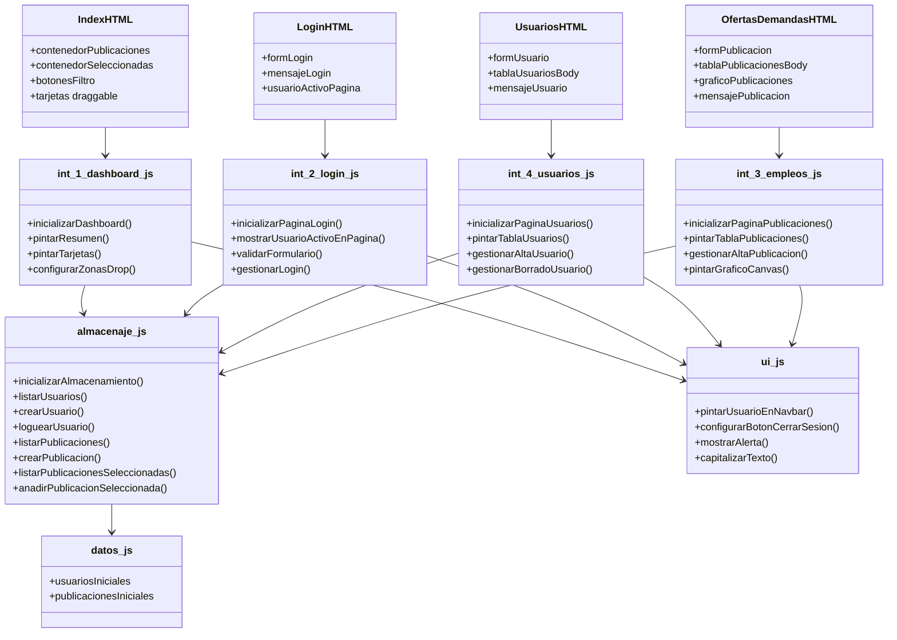

# Producto 2 · JobConnect · Requerimientos funcionales y diagrama de componentes

## 1. Componentes principales

- `index.html` + `assets/js/int_1_dashboard.js`
- `login.html` + `assets/js/int_2_login.js`
- `usuarios.html` + `assets/js/int_4_usuarios.js`
- `ofertas-demandas.html` + `assets/js/int_3_empleos.js`
- `assets/js/almacenaje.js`
- `assets/js/ui.js`
- `assets/js/datos.js`

## 2. Requerimientos funcionales por componente

### Login
1. Mostrar el usuario activo al cargar la página.
2. Validar correo y contraseña.
3. Autenticar contra usuarios guardados en WebStorage.
4. Mantener la sesión mediante `localStorage`.
5. Mostrar mensajes de éxito o error.

### Usuarios
1. Dar de alta nuevos usuarios.
2. Validar duplicados y campos obligatorios.
3. Consultar usuarios existentes en tabla dinámica.
4. Eliminar usuarios y refrescar la tabla.
5. Mostrar el usuario activo en la barra de navegación.

### Ofertas y demandas
1. Dar de alta publicaciones en IndexedDB.
2. Consultar publicaciones existentes en tabla dinámica.
3. Eliminar publicaciones.
4. Dibujar un gráfico nativo con Canvas.
5. Mostrar el usuario activo en la barra de navegación.

### Dashboard
1. Visualizar publicaciones disponibles.
2. Filtrar publicaciones por tipo.
3. Arrastrar publicaciones entre columnas con Drag & Drop.
4. Persistir la selección en IndexedDB.
5. Mostrar resumen numérico de usuarios, ofertas, demandas y seleccionadas.

## 3. Diagrama de componentes en Mermaid

## 4. Decisiones técnicas

- **WebStorage** para usuarios y usuario activo.
- **IndexedDB** para ofertas/demandas y para recordar la selección del dashboard.
- **Canvas** para dibujar el gráfico sin librerías externas.
- **Drag & Drop** para mover publicaciones entre disponibles y seleccionadas.
- **Programación modular** para centralizar la persistencia en `almacenaje.js`.
